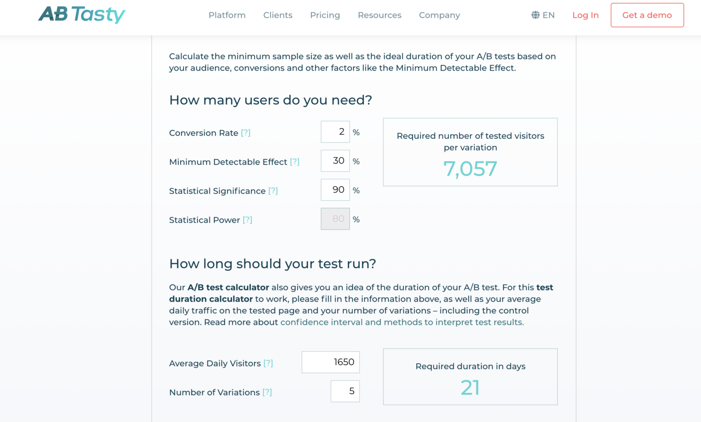

# A/B Testing: Improving UX

In an A/B test, we compare the performance of two or more versions of a site. When designing the experiment, several questions can emerge.

* How many different versions should be tested?
* What kind of changes can we implement in each version of the test (from changing just the color of a button to redesigning the whole site)?
* How can we show one version to a selected group of users and another version to a different group?
* Which metric should we chose to compare the different versions?
* Should we experiment with other elements of the site?
* How can we track, store and analyze the data from each version?
* How can we ever be sure that the version with the best performance is not having more clicks due to just chance?
* How long can we expect the experiment to last?

# The Library of Montana State University Case Study

The Library of Montana State University has a website that students use to find books and articles. This is how the Home page  like:

Below the library picture there is a search bar and three big items: "Find", "Request" and "Interact". All three of them contain access to important information and services that the library prides itself in offering. However, the Website Analytics show that the "Interact" button has, ironically, almost no interactions:

The way to measure how each one of the three categories perform is by click-through rate (CTR), a common term in Online Marketing which typically describes the number of clicks an ad receives divided by the number of times the ad is shown. Here, click-through rate is measured as the number of clicks on each item divided by the total number of visits on the website. The report from the team analysing the website shows the specific numbers and explains how they reacted to them:

During the sample period from April 3, 2013 - April 10, 2013, which included 10,819 visits to the library homepage, there was a large disparity among the three main content categories. The click-through rate for Find was 35%, Request was 6%, and Interact was 2%. This observation prompted a question: "Why are Interact clicks so low?" At this time the content beneath Interact included links to Reference Services, Instruction Services, Subject Liaisons, Writing Center, About, Staff Directory, Library FAQ, Give to the Library, and Floor Maps. The library's web committee surmised that introducing this category with the abstract term "Interact" added difficulty and confusion for users trying to navigate into the library website homepage. Four different category titles were then proposed as variations to be tested: Connect, Learn, Help, and Services.

In an A/B Test, one of the tasks that usually belongs to the UX team is to perform user research and develop a new version of the website element that needs to be tested. The team had conversations with a few students and asked the following questions:

* Have you previously clicked on Interact?
* What content do you expect to see after you select Interact?
* Does Interact accurately describe the content that you find after selecting Interact?
* Which word best describes this category? Interact? Connect? Learn? Help? Services?

Here are some of the responses from three of the students.

Sophomore student:

* "I didn't know that 'About' was under Interact.'"
* "Learn doesn't work."
* "Connect is too vague and too close to Interact."
* "Services is more accurate. Help is stronger."
* "Floor maps seem odd here."
* In order of preferences of the choices, this student responded: Help, Services, Interact, Connect, Learn

Junior student:

* "I am not a native English speaker, so I look for strong words. I look for help, so Help is the best, then Services too."

Senior student:

* "I've never felt the need to click on Interact. What am I interacting with? I guess the library?"
* "I never knew floor maps were there, but I have wondered before where certain rooms were."
* "Help makes sense. When I'm in the library, and I think I need help, it would at least get me to click there to find out what sort of help there is."
* "Services also works."
* "Learn doesn't really work. I just think, What am I learning? I think of reading a book or something."
* "Connect is better than Interact, but neither are very good."
* In order of preferences of the choices, this student responded: Help, Services, Connect, Interact, Learn

## Exploring the Data from the Experiment

After the interviews with the users and some brainstorming, the website team settled on 4 different new versions to test against the original "Interact" button:

* Connect
* Learn
* Help
* Services

The metrics that were deemed more relevant to track were the following:

* Click-through rate (CTR) for the homepage. Defined as the amount of clicks on the button divided by the total visits to the page. Selected as a measure of the initial ability of the category title to attract users.
* Drop-off rate for the category pages. Percentage of visitors who leave the site from a given page, selected as a measure of the ability of the category page to meet user expectations.
* Homepage-return rate for the category pages. percentage of users who navigated from the library homepage to the category page, then returned back to the homepage. This sequence of actions provides clues as to whether a user discovered the desired option on the category page; if not, the user would likely then return to the homepage to continue navigation. Homepage-return rate was therefore selected as a measure of the ability of the category page to meet user expectations.

While all the metrics will be relevant for the decision-making process, it was decided that for a version to be considered superior, a minimum increase in click-through rate of 30% had to be detected.

The hypotheses to be tested in the experiment are the following:

* Null Hypothesis: all variants have the same CTR.
* Alternative Hypothesis: there is a difference in the CTR for the different variants.

The desired Statistical Significance was chosen to be 90%: it is a bit lower than the usual scientific standard of 95% because the consequences of rejecting the null hypothesis when it is true (i.e. concluding there is an effect when there is none) are not tragic, and there are constraints in the amount of time the team of experimenters have: quickness was prioritized over certainty.

Currently, the CTR for Interact sits at around 2%, and the page has around 1650 visitors every day.  With these numbers, [a power calculator like this one](https://www.abtasty.com/sample-size-calculator/) can be used to decide on the length of the test. The length of the experiment was established at 21 days:

The test ran between May 29, 2013 and June 18, 2013. You will find the the CrazyEgg folder data that was extracted from [crazyegg](https://www.crazyegg.com/), a service that tracks traffic to websites and provides insights and well structured data.

I Explore the data and tackle these questions:

* What was the click-through rate for each version?
* Which version was the winner?
* Do the results seem conclusive?

Next, I perform the significance test that will tell us whether the results are statistically significant.

## Performing a Chi-square Test

While exploring the data from the different versions of the website, I have discovered that they had strong differences in click-through rates. Those rates can be calculated by simply dividing the clicks that each element of interest got (the elements "Interact", "Learn", "Help"...) by the overall number of visits on each page:

It seems like "Interact" and "Learn" are the worse performers, while "Services" and "Connect" perform much better better. But, are those differences due to chance? This is what will be tested:

* Null Hypothesis: The 5 versions of the button are equally likely to receive clicks, and the observed differences are due to chance.
* Alternative Hypothesis: The observed differences are not due to chance: there are versions of the button that are more likely to receive clicks (i.e. they have a better CTR, a better performance).

By going back to the original counts that produce these rates, a contingency table like the one below, can be created. Since the interest is only in people clicking on that single element, here the counts on "Click" are the clicks on that element and "No-click" is simply calculated as visits - clicks:

This is how data should be shaped so that we can perform a chi-square test using thechi2_contingency function from scipy, and finally see whether the results are significant. In other words, whether the values on the rows ("Click" or "No-click") depend on the values on the columns ("Interact", "Connect", "Learn", "Help", "Services").

`from scipy import stats`

`chisq, pvalue, df, expected = stats.chi2_contingency(your_contingency_table)`

For a confidence level of 90%, the significance level is 1 - 0.9 = 0.1. So, I check whether the p-value is smaller than 0.1 or not. If the p-value is smaller than the significance level, it will mean that the Null Hypothesis is rejected, the clicks indeed depend on the version of the website. But, does this tell the real winner? Not yet! This just tells that some versions indeed perform better than others. We can be sure that the best version (Services) performs better than the worst one (Interact), but we cannot be certain that the differences between "Services" and "Connect" or "Learn" are significant.

One possible approach to solve this is to narrow down the candidates: simply kick out the worst performer, and run the test again. In this case, we will drop "Interact":

The process is repeat while the p-value remains below the significance level (0.1).

